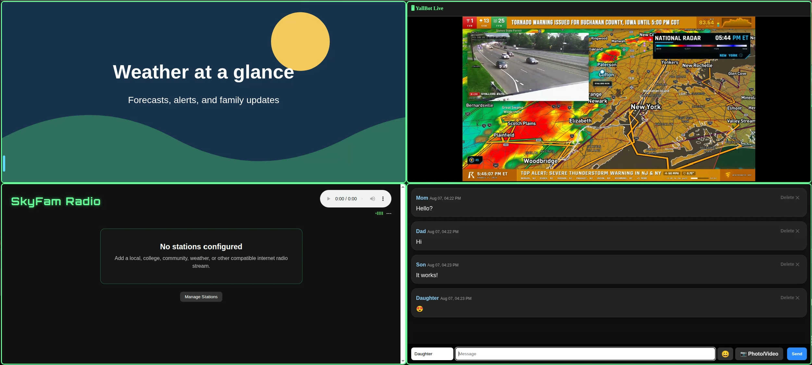

# SkyFam

A free, self-hosted family dashboard for messaging, photo slideshows, weather updates, radio, and games.

## Status

SkyFam is currently under active development and is not yet ready for public release.

The project is designed to run on a user's own home server, with an emphasis on simple family communication, weather awareness, and locally managed content.

## Features

- Family messaging with photo and video attachments
- Photo slideshow for shared family pictures
- Weather-focused dashboard content
- Embedded weather video
- Internet radio player with administrator-managed stations
- Simple built-in games
- Self-hosted storage and configuration

## Weather Video

SkyFam can display weather-focused YouTube content using YouTube's embedded player.

Video remains hosted and delivered by YouTube. SkyFam does not download, record, restream, or redistribute video content.

The weather video source can be configured by the SkyFam administrator. Optional live-channel detection is also being developed so SkyFam can automatically switch to a configured weather channel when that channel is live.

The public SkyFam project is not affiliated with or endorsed by any YouTube creator or weather-media provider unless specifically stated.

## Radio

SkyFam includes an optional internet radio player.

Radio stations are managed by the administrator of each SkyFam installation. SkyFam does not operate or relay a centralized radio streaming service. When a station is played, the user's browser connects directly to the configured stream provider.

The public SkyFam project does not currently include any preconfigured third-party radio stations.

Support for optional NOAA Weather Radio streams is being explored, subject to permission and any usage or attribution requirements from the stream provider.

## Screenshot

*SkyFam dashboard showing weather, family messaging, photo slideshow, and internet radio features.*

## Development

More information, installation instructions, configuration options, and licensing details will be added as development continues.
