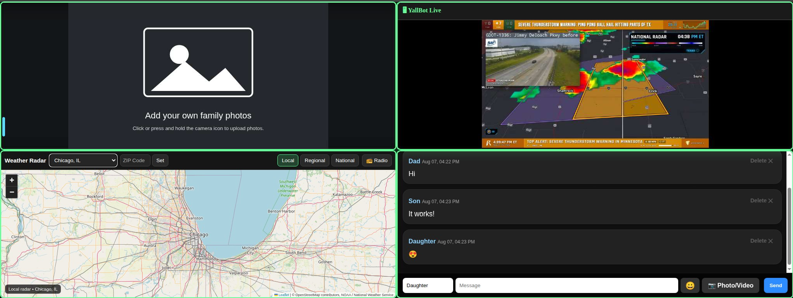

# SkyFam

SkyFam is a self-hosted family dashboard designed for TVs, monitors, tablets, Raspberry Pis, and other always-on displays.
> **[Read why I built SkyFam →](AUTHOR_NOTE.md)**

It combines several family-oriented features into one place:

- Family dashboard
- FamilyChat
- Internet radio
- YouTube livestream support
- Manual Live Events
- Built-in browser games
- Photo slideshow
- Optional HTTPS access



> **Project Status**
>
> SkyFam is currently in active testing and development.
>
> It is usable now, but installation steps and features may continue to change as testing continues.

---

# What You Need

## SkyFam Server

SkyFam currently targets:

**Debian 13 (Trixie)**

The server can be:

- A physical PC
- Raspberry Pi (Tested Successfully on a 4) 
- Mini PC
- Virtual machine
- Proxmox VM or LXC
- Another Debian 13 system

You will need:

- Internet access during installation
- A user with `sudo` or root access
- A network connection
- Enough disk space for your family's photos, chat uploads, and videos

You do **not** need to know Python, Flask, systemd, or GitHub to install SkyFam.

## Storage

The SkyFam application itself is not especially large, but uploaded media can use much more space over time.

SkyFam may store:

- Slideshow photos
- FamilyChat photos
- FamilyChat videos
- Other uploaded FamilyChat media

Suggested starting points:

- **20 GB free** for testing and light use
- **50 GB or more** for regular family photo use
- **100 GB or more** if FamilyChat will regularly receive photos and videos

Video uploads can consume storage quickly.

FamilyChat also includes an **automatic cleanup process for older uploaded files**, which helps prevent uploads from growing forever. However, you should still keep an eye on available disk space if your family shares a lot of media.

---

# Display Devices

The SkyFam server does not need to be connected directly to a TV or monitor.

Once SkyFam is running, almost any device with a web browser can display it.

Examples include:

- Raspberry Pi
- Windows PCs
- Linux PCs
- Laptops
- Tablets
- Kiosk computers connected to TVs or monitors

A Raspberry Pi works well as a dedicated SkyFam display.

The display device only needs network access to the SkyFam server.

Older Raspberry Pi models may work better with a lightweight browser or kiosk renderer instead of Chromium.

---

# Quick Install

These instructions are intended for people who may not have much GitHub or Linux experience.

## 1. Install Git

Log into your Debian 13 server and run:

```bash
sudo apt update
sudo apt install -y git
```

Git is the program that downloads SkyFam from GitHub and allows you to retrieve future updates.

## 2. Download SkyFam

Run:

```bash
git clone https://github.com/DakotaS96/SkyFam.git
```

Then enter the SkyFam folder:

```bash
cd SkyFam
```

## 3. Run the Installer

Run:

```bash
sudo bash install.sh
```

The installer handles most of the setup automatically.

It will:

- Install required Debian packages
- Install SkyFam under `/opt`
- Create the Dashboard service
- Create the FamilyChat service
- Create the SkyFam Radio service
- Ask you to create a SkyFam administrator password
- Optionally configure a YouTube Data API key
- Configure SkyFam to start automatically after reboot
- Start the services
- Test that the services are responding
- Ask how you want to access SkyFam

You will be given three networking choices:

1. Automatic HTTPS setup using Caddy
2. Use your own reverse proxy
3. Local-network-only access

If you are just getting started, **LAN access only is perfectly fine**.

## 4. Open SkyFam

At the end of installation, SkyFam displays the local addresses you can use.

The main dashboard will normally look like:

```text
http://SERVER-IP:5000
```

For example:

```text
http://192.168.1.50:5000
```

Open that address from another computer, tablet, Raspberry Pi, or kiosk device on the same network.

That's it. SkyFam should now be running.

---

# Updating SkyFam

If you installed SkyFam through GitHub, updates can be downloaded with Git.

Go to the folder where you originally downloaded SkyFam:

```bash
cd SkyFam
```

Then run:

```bash
git pull
```

Because SkyFam is still being developed, check the project notes before applying major updates.

Some updates may require restarting services or rerunning part of the installer.

---

# Raspberry Pi Kiosk Use

A Raspberry Pi can be used as a dedicated SkyFam display.

The Raspberry Pi does **not** need to host the SkyFam server.

A typical setup looks like:

```text
SkyFam Debian Server
        |
      Network
        |
   Raspberry Pi
        |
   TV / Monitor
```

The Raspberry Pi simply opens the SkyFam dashboard in a browser.

For example:

```text
http://YOUR-SKYFAM-SERVER:5000
```

or your configured HTTPS address.

Older Raspberry Pi models may benefit from a lightweight browser or kiosk renderer rather than Chromium.

More detailed Raspberry Pi kiosk instructions are planned as testing continues.

---

# # Administrator Features

SkyFam includes a hidden administrator interface. To open it, press and hold the **YallBot** text in the upper-left corner of the embedded YallBot YouTube player.

Current administrator features include:

* Internet radio controls
* YouTube API settings
* Manual Live Event controls
* Change Admin Password

During installation, SkyFam asks the administrator to create and confirm a password. Fresh installations do not use a default administrator password.

This password controls SkyFam’s administrator features. It is separate from the Debian/Linux root password and does not provide access to the Linux root account.

Changing the SkyFam administrator password does **not** change the Linux root password.

The SkyFam administrator password is stored locally in:

```text
/etc/skyfam-admin.env
```

This file contains sensitive information and should never be uploaded to GitHub.

---

# YouTube Support

SkyFam can optionally use the YouTube Data API for automatic livestream detection.

A YouTube API key is **not required** for the basic SkyFam dashboard. However, it is recommended for alerting when Ryan Hall goes live for severe weather streams.

For step-by-step instructions with screenshots, see:

[Create a YouTube Data API Key for SkyFam](docs/YOUTUBE_API_SETUP.md)

If configured, the API key is stored locally in:

```text
/etc/skyfam-youtube.env
```

The key can also be changed through the SkyFam administrator interface.

Never publish your YouTube API key.

---

# Manual Live Events

SkyFam allows an administrator to temporarily send a YouTube video or livestream to connected SkyFam displays.

Current features include:

- Password-protected Start Event
- Global Stop Event
- Local Close button on individual displays
- Return to YallBot in a paused state
- Twelve-hour failsafe for forgotten events

This can be useful for:

- Family events
- Graduation streams
- Weather coverage
- News events
- Sports or community streams
- Anything your family wants to watch together

---

# Photos and FamilyChat

SkyFam includes a photo slideshow and FamilyChat.

FamilyChat supports uploaded media such as photos and videos.

Because media can become much larger than the SkyFam application itself, available storage should be monitored on systems that receive a lot of uploads.

SkyFam includes an automatic cleanup process for older FamilyChat uploads to help manage storage.

Slideshow photos are intended to remain available until you remove them, so a large slideshow collection can also increase storage requirements over time.

## FamilyChat Moderation

Set the FamilyChat display name to `Silver` to reveal moderator delete controls. The first attempt to delete a message written by another user requires the existing SkyFam administrator password.

Successful authentication unlocks Silver moderator access for that browser session. Closing the browser ends the moderator session. Other FamilyChat users can delete only their own messages.

---

# Network Services

SkyFam runs three web services:

| Service | Port | Installation Folder |
|---|---:|---|
| Dashboard | 5000 | `/opt/dashboard` |
| FamilyChat | 5050 | `/opt/familychat` |
| SkyFam Radio | 5080 | `/opt/skyfam-radio` |

The installer creates these systemd services:

```text
dashboard.service
familychat.service
skyfam-radio.service
```

To check their status:

```bash
systemctl status dashboard
systemctl status familychat
systemctl status skyfam-radio
```

To restart the dashboard:

```bash
sudo systemctl restart dashboard
```

---

# Local Network Access

You do not need a domain name to use SkyFam.

If you choose:

```text
LAN access only
```

during installation, you can use the server's local IP address.

Example:

```text
http://192.168.1.50:5000
```

This is the easiest setup for initial testing.

---

# HTTPS and Reverse Proxies

SkyFam can optionally use HTTPS addresses such as:

```text
https://skyfam.example.com
https://chat.example.com
https://radio.example.com
```

The installer can configure Caddy automatically.

You can also use your own reverse proxy, including:

- Caddy
- Nginx
- Nginx Proxy Manager
- Traefik
- Cloudflare Tunnel
- Other reverse proxies

SkyFam's local backend addresses are:

```text
Dashboard:  http://127.0.0.1:5000
FamilyChat: http://127.0.0.1:5050
Radio:      http://127.0.0.1:5080
```

When using a reverse proxy, SkyFam stores your public URLs in:

```text
/etc/skyfam-public.env
```

Example:

```text
SKYFAM_DASHBOARD_URL=https://skyfam.example.com
SKYFAM_CHAT_URL=https://chat.example.com
SKYFAM_RADIO_URL=https://radio.example.com
```

---

# Private Configuration

Private configuration is intentionally stored outside the GitHub repository.

Examples include:

```text
/etc/skyfam-admin.env
/etc/skyfam-youtube.env
/etc/skyfam-public.env
```

These files should never be committed to GitHub.

Private runtime data such as:

- FamilyChat history
- Uploaded family photos
- Uploaded videos
- Personal configuration
- API keys
- Passwords

should also remain out of the public repository.

---

# Games and Third-Party Software

SkyFam includes several bundled open-source games and other third-party components.

Some have been modified for SkyFam's kiosk/dashboard environment.

Original authorship, licensing, source information, and SkyFam modification notes are documented in:

```text
THIRD_PARTY.md
```

Original license and notice files are preserved where provided by the original projects.

SkyFam modifications are not endorsed by the original authors unless specifically stated.

---

### Radio Browser Disclaimer

SkyFam can use the public [Radio Browser](https://www.radio-browser.info/) directory to help administrators find internet radio stations.

SkyFam is not affiliated with or endorsed by Radio Browser or any radio station listed through its service. Radio station names, logos, trademarks, programming, and audio streams belong to their respective owners.

Radio Browser provides station information and stream addresses, but the audio is delivered by the individual station providers. SkyFam does not host, operate, control, or guarantee the availability, accuracy, content, or reliability of third-party radio streams.

# Current Support

Current SkyFam server target:

```text
Debian 13 (Trixie)
```

Other Linux distributions may work, but Debian 13 is currently the supported installation target.

Raspberry Pi devices are supported as SkyFam display/kiosk devices.

SkyFam is still in testing, so feedback and bug reports are welcome.

---

# Reporting Problems

If you run into a problem, useful information includes:

- What you were trying to do
- What device you were using
- Debian version if the problem involves the server
- Any error shown on screen
- Relevant service status or log output

Please do **not** include passwords or API keys in bug reports.

---

# Credits and Licensing

SkyFam's original project code is licensed under the **GNU General Public License version 3 or later** (`GPL-3.0-or-later`).

If you distribute a modified version of SkyFam, you must make the corresponding source code available under the same license.

Bundled third-party components remain under their respective licenses.

See:

```text
THIRD_PARTY.md
```

for third-party projects, original authors, licensing, attribution, and SkyFam modification information.
