# Create a YouTube Data API Key for SkyFam

SkyFam uses the YouTube Data API to check YouTube for supported livestream information. This guide walks through creating a Google Cloud project, enabling the YouTube Data API, creating a restricted API key, and saving it in SkyFam.

You will need:

- A Google account
- Access to your SkyFam administrator interface
- Your SkyFam administrator password

> [!IMPORTANT]
> Treat your API key like a password. Do not post it publicly, include it in screenshots, or commit it to GitHub.

Google occasionally changes the appearance of the Cloud Console. The wording or location of a button may vary slightly from these screenshots.

## Create a Google Cloud project

1. Open the [Google Cloud Console](https://console.cloud.google.com/).

2. Sign in with your Google account.

3. If prompted, select **I agree**, then click **Agree and continue**.

   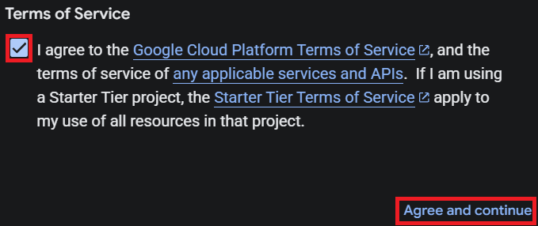

4. At the top of the page, click **Select a project**.

   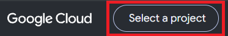

5. Click **New Project** in the upper-right corner.

   

6. Enter a project name, such as `SkyFam`.

   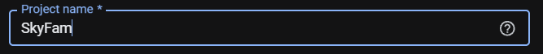

7. Click **Create**.

   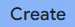

8. When the project is ready, click **Select Project**.

   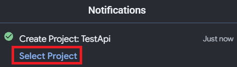

## Enable YouTube Data API v3

1. Open the navigation menu on the left and select **APIs & Services**, then **Enabled APIs & services**.

   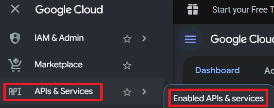

   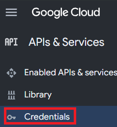

2. Search for `YouTube Data API v3`.

3. Select **YouTube Data API v3**, then click **Enable**.

4. Wait for Google Cloud to finish enabling the API before continuing.

## Create and restrict the API key

1. Under **APIs & Services**, select **Credentials**.

   

2. Click **Create credentials**, then select **API key**.

   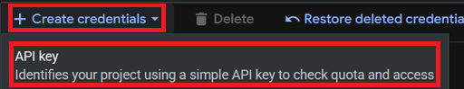

3. Enter a recognizable name for the key, such as `SkyFamYouTube`.

   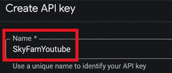

4. Under **API restrictions**, click the field that says **No APIs selected**.

   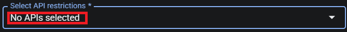

5. Select **YouTube Data API v3**, then click **OK**.

   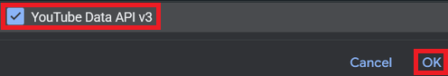

6. Click **Create** at the bottom of the page.

   

7. When Google displays the API key, click the copy icon.

   

## Add the key to SkyFam

1. Open SkyFam's administrator interface by pressing and holding **YallBot Live** in the upper-left corner of the YallBot panel.

2. Open **API Settings**.

3. Paste the copied key into **YouTube Data API v3 Key**.

   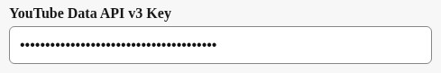

4. Enter your SkyFam administrator password.

   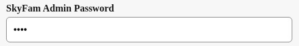

5. Click **Test Key**.

   

6. When SkyFam reports that the YouTube API key works, click **Save**.

   

7. Confirm that SkyFam reports **YouTube API key saved**.

   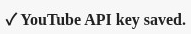

8. Click **Close**.

   

The YouTube API key is now configured for SkyFam.

## Troubleshooting

- If the key test fails, confirm that **YouTube Data API v3** is enabled for the same Google Cloud project that owns the key.
- Confirm that the key's API restriction includes **YouTube Data API v3**.
- Make sure the entire key was copied without spaces before or after it.
- If Google Cloud was just configured, wait a few minutes and test the key again.
- Never post the API key in a GitHub Issue or include it in a public screenshot.

For Google's current requirements, see the official [YouTube Data API overview](https://developers.google.com/youtube/v3/getting-started) and [API key documentation](https://docs.cloud.google.com/docs/authentication/api-keys).

[Back to the SkyFam README](../README.md)
